# Work with your logs via LogDNA

Now, you are can effectively analyze your application logs via LogDNA.

## Step 1 - Access LogDNA

To open LogDNA UI in IBM Cloud,

1. Login to [IBM Cloud](https://cloud.ibm.com) in a browser.

1. Navigate to https://cloud.ibm.com/kubernetes/clusters to see a list of available IKS clusters.

1. select your IKS cluster from the list to open it. You are in the `Overview` tab by default.

    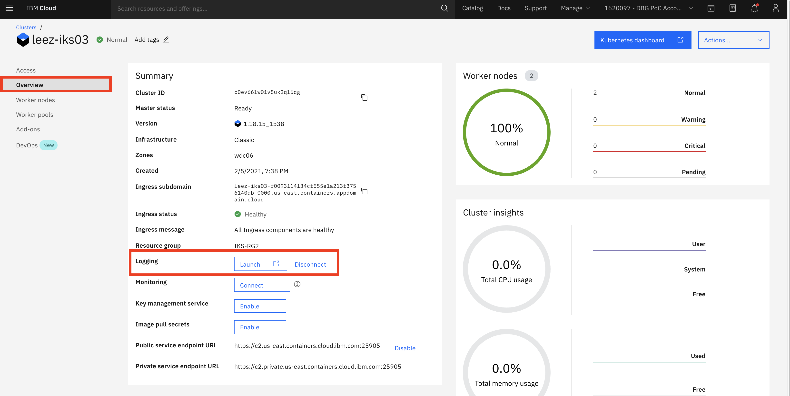

1. Select `Launch` button next to the `Logging`.

1. LogDNA window displays everything by default.

    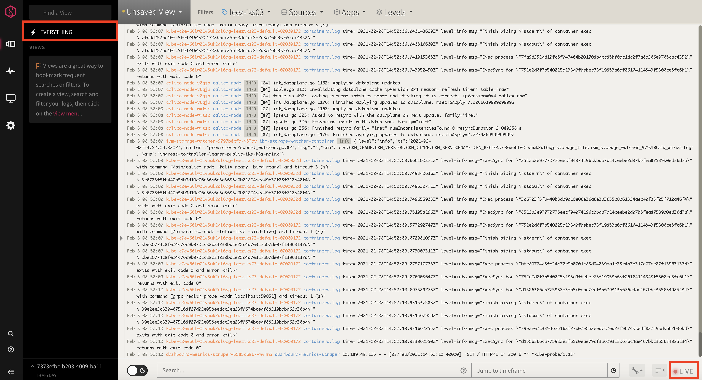

1. LogDNA live-streams all log entries by default. You may turn OFF/ON `LIVE` log stream via the `LIVE` toggle button.


## Step 2 - Search for specific terms in logs

If you know what you are looking for, it's easy and convenient to search log entries in LogDNA.

1. In the `Search` input box located at the bottom of the page in the LogDNA UI, enter `GET "/owners"` and press ENTER.

    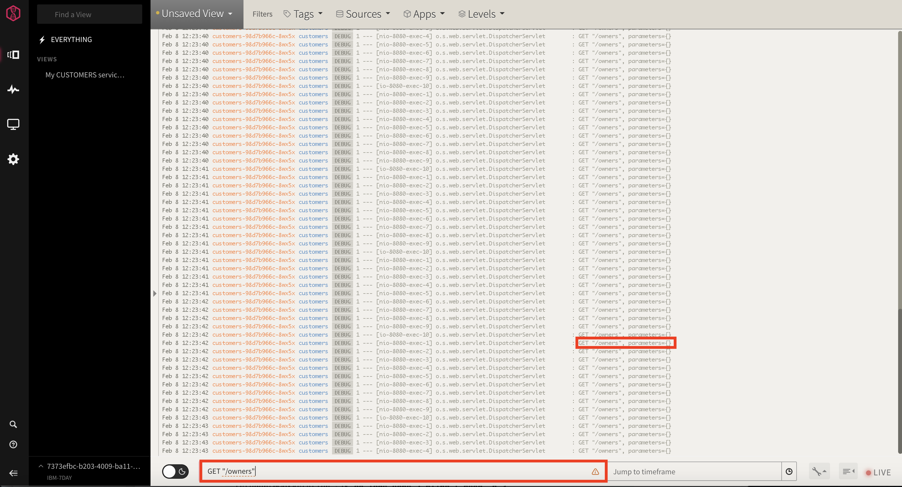

1. Review the search result. All remaining log entries contains string `GET "/owners"`.

1. Select any log entry and expand it by click the arraw in the front of the line.

1. This displays detail information of the log entry.

    

1. Select `View in context`.

1. The log line will be displayed in context of other log lines from that host, app, or both. This information is helpful when troubleshooting a problem.

    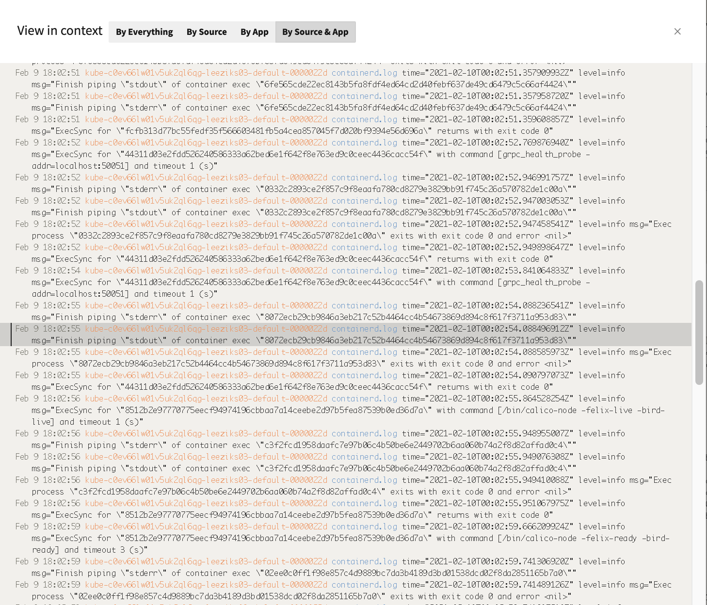

1. Select `EVERYTHING` in the top-left corner to clear the searching criteria and restore all log entries.

1. In the `Search` input box located at the bottom of the page in the LogDNA UI, enter `level:error` and press ENTER.

1. Review the search result and only `error` log entries remain.

1. Select `EVERYTHING` in the top-left corner to clear the searching criteria and restore all log entries.

1. Enter `2 mins ago` in the `Jump to timeframe` input box and press ENTER. 

1. LogDNA jumps to a specific timeframe, Click the icon next to the input box to find the other time formats within your retention period.

    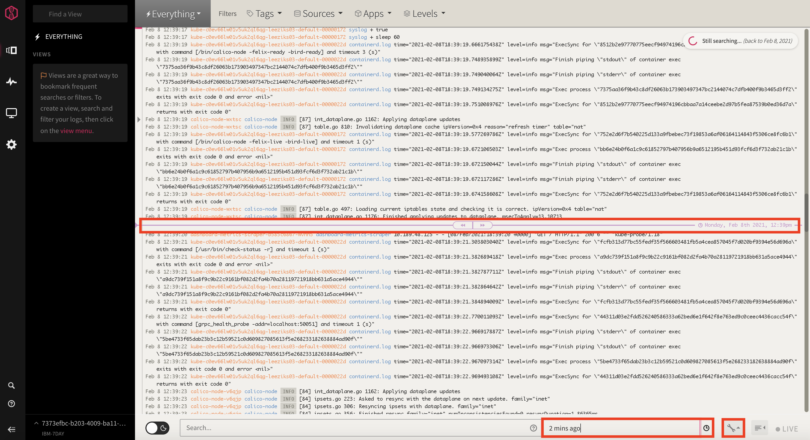

1. Select the `Toggle Viewer Tools` icon at the bottom-right.
    * Enter `error` as your highlight term in the first field and press ENTER.
    * Enter `container` as your highlight term in the second field and press ENTER.
    * Click the `Toggle Viewer Tools` icon to close the pop-up window.

    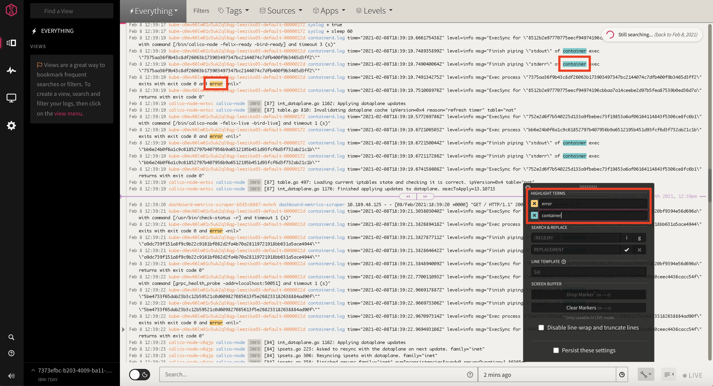

1. Click on `Toggle Timeline` icon to see log entries at a specific time of a day.

    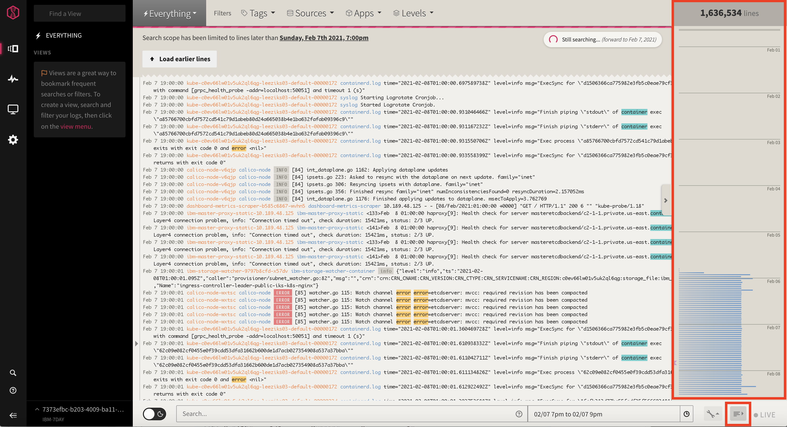

## Step 3 - Filter logs for a specific container

You can filter logs by tags, sources, containers or levels.
* Tags: related to IKS clusters
* Sources: related to IKS pods
* Containers: related to IKS containers. Since one containers typically runs one microservice per cloud native development best practice, each container should represent one microservice. For example, `customers` container represents `customers` service component.
* Levels: related to log level, for example error or debug.

To filter logs,

1. On LogDNA UI, select `EVERYTHING` in the top-left corner to clear the searching criteria and restore all log entries.

    

1. Select `Tags` dropdown list on the top. You can filter log entries related to a single cluster or a set of clusters. For this exercise, you don't have to change anything.

1. Select `Sources` dropdown list, you may filter log entries related to one Kubernetes pod or a set of pods. For this exercise, you don't have to change anything.

1. Select `Apps` dropdown list, you may filter log entries related to one Kubernetes container or a set of containers. 

1. Select `Customers` checkbox under the `Containers` section and `Apply`. Now, you see log entries for `Customers` service component only. Most of the entries are for `DEBUG` purpose.

    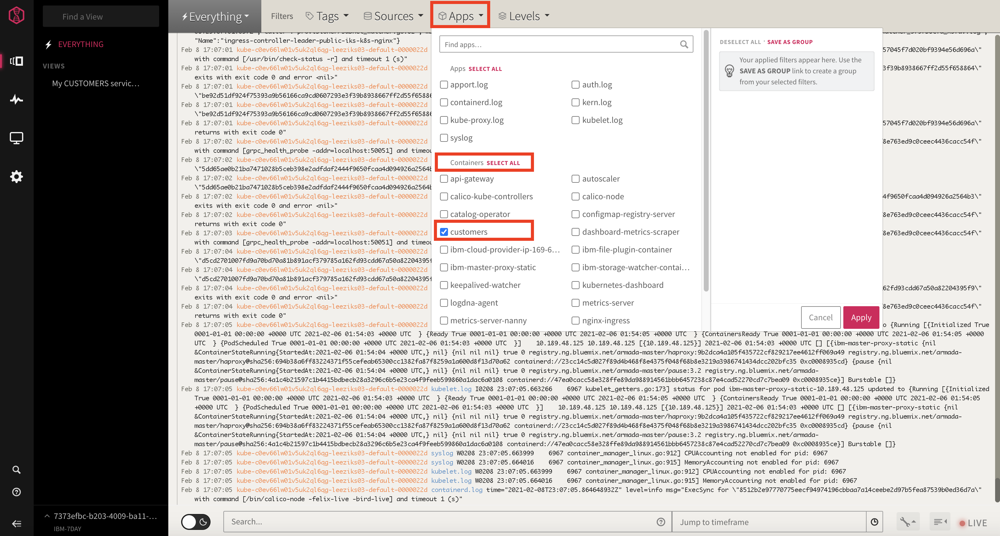

1. Select `Levels` dropdown list, you may filter log entries related to one log level or a set of log levels.

1. Select everything except `DEBUG` log level and `Apply`. 

1. You may see no log entry or a few lines of log entries, depend on your log entries.


## Step 4 - Create a new view

You may create a new view to save your current filter.

1. Click `Unsaved View` on the LogDNA UI and select `Save as new view`.

1. In the `Name` field, enter `My CUSTOMERS service component`.

1. Select `Save View`.

    


## Step 5 - Visualize logs with graphs and breakdowns

In this section, you will create a board and then add a graph with a breakdown to visualize the app level data. A board is a collection of graphs and breakdowns.

1. In the left pane, select the `Boards` icon and then select `NEW BOARD`.

1. Click `Edit` icon (`Pencil` icon next to the `New Board` title) on the top bar.

1. In the `Name` field, enter `Debug Board`. Click `Save`.

1. Click `Add Graph`.

1. Under the `Graph a field` section, select `level` in the first field.

1. Second field `Field Value` appears. 

1. Select `debug` in the  `Field Value` field.

    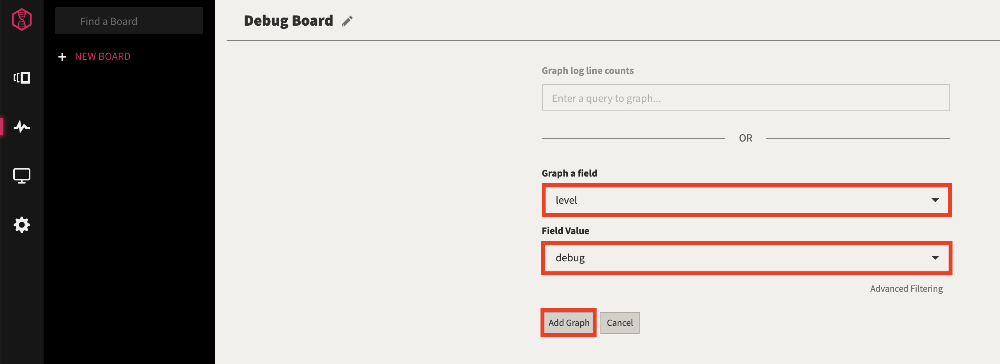

1. Click `Add Graph`.

1. `Counts` is selected as your metric by default. The graph shows the number of log entries in the interval over last 24 hours.

    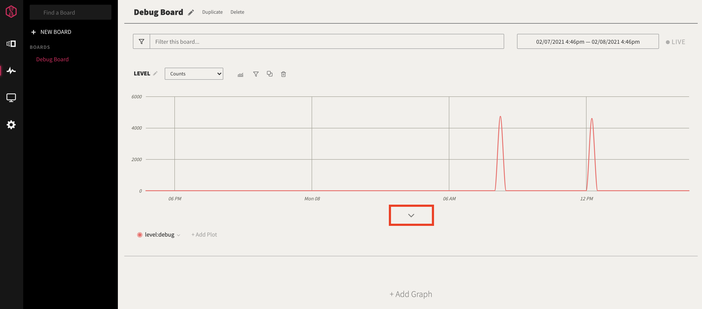

1. Extend the graph by clicking on the downn-arrow below the graph.

1. Select `Histogram` as your `breakdown type`.

    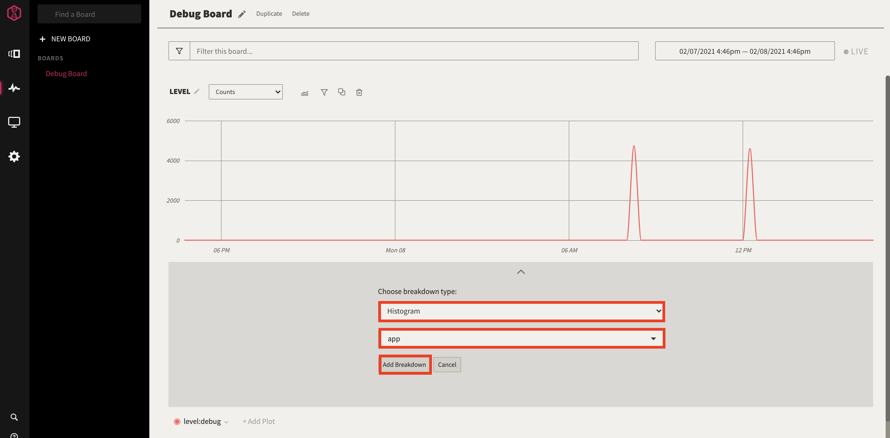

1. Choose `app` in the second field.

1. Select `Add Breakdown` to see a breakdown with all the apps you logged.

    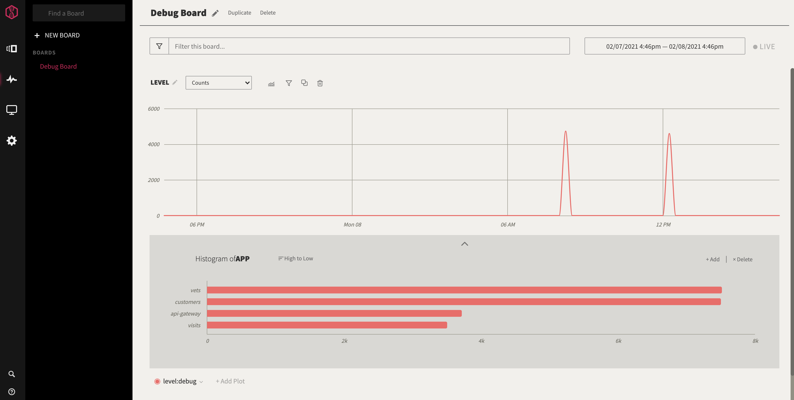


## Step 6 - Alerts

You can trigger alerts in LogDNA whenever log lines appear in a custom view. The sample alert configuration in this section sends an email for every 3 new log entries that meet searching criteria.

### Step 6.1 - Create custom view

To create an alert in LogDNA,

1. Navigate to the homepage of the LogDNA.

1. Select `EVERYTHING`.

1. Enter `GET "/owners"` in the `Search` field and press ENTER.

1. Click `Unsaved View` button on the top-left and select `Save as new view`.

1. Enter `REST Call` in the `Name` field.

1. Select `Save View` button.


### Step 6.2 - Create alert

1. Select `Settings` in the left pane.

1. Select `ALERTS` tab.

1. Select `Add Prset` button.

1. Enter `customer-api-called` as the `Preset name`.

    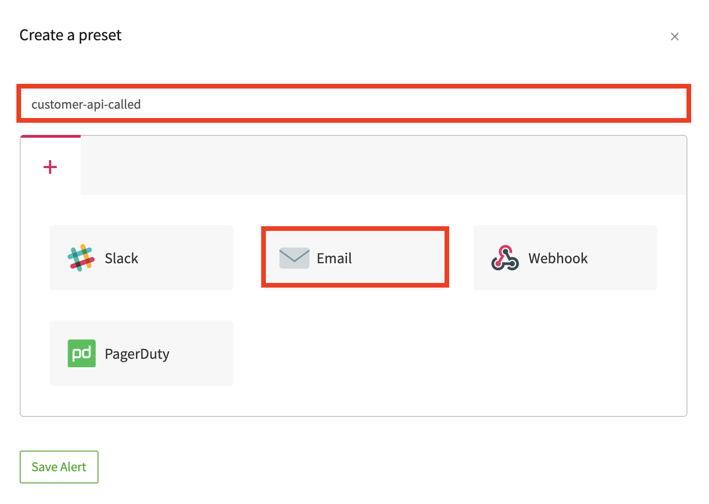

1. Select `Email` option.

1. Triggers the alert when there are `3 Lines` appears in `30 seconds`.

1. Send an alert `At the end of 30 seconds`.

1. Turn on `Custom schedule` and review the settings. Make change if necessary.

1. Enter your email address.

1. Select your `Timezone`.

    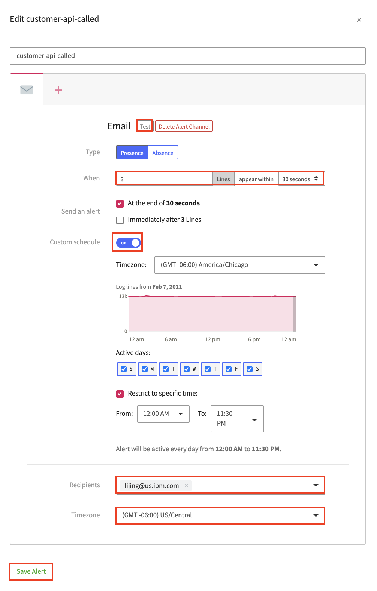

1. Click `Test` button next to the `Email`.

1. You should receive an email from `LogDNA Alerts` with the following testing contents.

    ```
    Test View 🔔

    2 test lines matched

      Feb 08 17:45:56 logdna alert_tester This is where your lines will show up
      Feb 08 17:45:56 logdna alert_tester After matching at least 3 lines in a 30 second period, we'll send an alert to this email with all the matched lines
    ```

1. `Save Alert`.


### Step 6.3 - Attach alert and custom view

To link alert and custom view in LogDNA,

1. Select `Views` tab in the left pane.

1. Select `REST Call` custom view.

    

1. Click the `REST Call` dropdown menu on the top-left.

1. Select `Attach an alert` option. 

    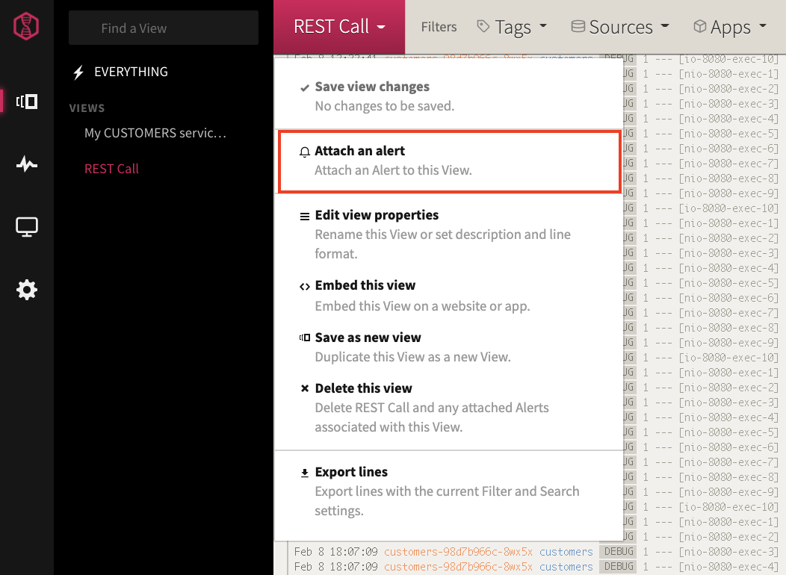

1. Select `customer-api-called` alert.

    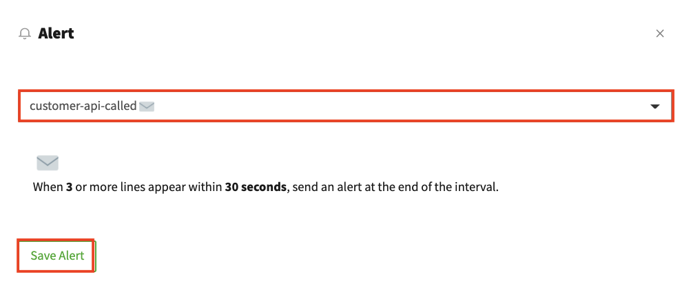

1. `Save Alert`.


### Step 6.4 - Trigger alert

To trigger the LogDNA alert, you'll generate additional application log entries.

1. Go back to `IBM Cloud Shell` terminal.

1. Verify that the Pod name was stored in the environment variable `API_GATEWAY_POD`.

    ```
    echo $API_GATEWAY_POD
    ```

  > Note: please revisit section `Generate application log entries`.

1. Get into the `API-Gateway' pod.

    ```
    kubectl exec $API_GATEWAY_POD -ti sh
    ```

1. The prompt change shows that you are in the `API-Gateway` pod now.

1. Copy/paste and Execute the following command in the pod. The script sends 100 requests to each service component.

    ```
    for i in `seq 1 3` ; do wget -q -O - http://customers-service/owners ; done
    ```

1. Exit the pod.

    ```
    exit
    ```

1. Verify you received an email from 

    ```
    REST Call 🔔 (end of duration)

    3 lines matched within 30 seconds

    Feb 08 19:14:01 customers-98d7b966c-8wx5x customers [DEBUG] 1 --- [io-8080-exec-10] o.s.web.servlet.DispatcherServlet        : GET "/owners", parameters={}
    Feb 08 19:14:01 customers-98d7b966c-8wx5x customers [DEBUG] 1 --- [nio-8080-exec-8] o.s.web.servlet.DispatcherServlet        : GET "/owners", parameters={}
    Feb 08 19:14:01 customers-98d7b966c-8wx5x customers [DEBUG] 1 --- [nio-8080-exec-9] o.s.web.servlet.DispatcherServlet        : GET "/owners", parameters={}
    ```


## Step 7 - Review the log format

When you launch the IBM Log Analysis with LogDNA web UI, log entries are displayed in a predefined format. You can modify how the log entries are displayed.

> Note: Configuration changes of the log format in this section will affect all defined views. It's possible to change log format for individual view.

1. Select the `Settings` icon in the left pane.

1. Select `USER PREFERENCES`.

1. Select `Log Format` tab.

    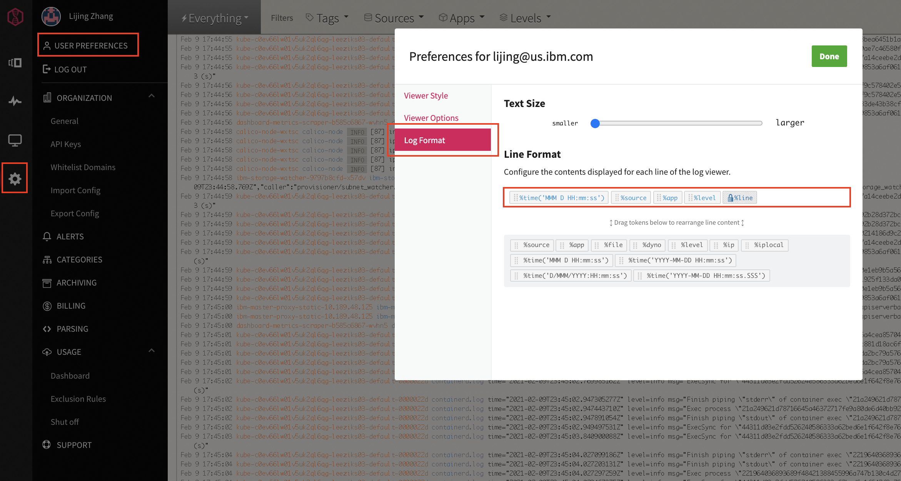

1. Review the default log format and available log components. Do not make any change for this exercise.
    * Change the log viewer text size by using the slider.
    * To add items to log view, drag the available items from the bottom line to the top line. 
    * To rearrange the order of the items, drag and drop the items in the top line until you have your desired view.


