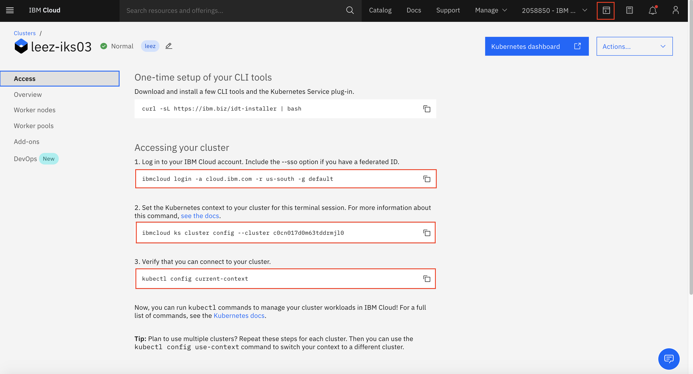

# Prepare exercise environment

[IBM Cloud Shell](https://cloud.ibm.com/shell) is used to deploy the petclinc sample application in this repo. You may use other terminal options if required CLI tools are installed.

## Step 1 - Access IBM Cloud and Kubernetes cluster

Before deploying petclinic application to IKS cluster, you need to get your working environment ready.

1. Login to [IBM Cloud](https://cloud.ibm.com) in a browser.

1. Navigate to https://cloud.ibm.com/kubernetes/clusters to see a list of available IKS clusters.

1. select your IKS cluster from the list to open it.

1. In the left pane, select `Access` option. This page provides CLI commands to setup your terminal environment to work with your IKS cluster. It also has a link to start a `IBM Cloud Shell`.

    

1. Click `IBM Cloud Shell` link next to your account number on the toolbar. It's on the top-right corner of the screen. This opens `IBM Cloud Shell` window in a new tab of your browser.

1. Store cluster name in environment variable.

  ```
  export MYCLUSTER=<your cluster name>
  echo $MYCLUSTER
  ```

1. Execute the CLI commands in the `Access` tab of your IKS cluster (see above) sequentially to connect to your cluster.

1. Use CLI command `kubectl config current-context` to verify the connection to your cluster before continue the exercise.


## Step 2 - Clone the repo

In the `IBM Cloud Shell`, clone the repo.

  ```
  git clone https://github.com/lee-zhg/manage-logs-logdna

  cd manage-logs-logdna
  ```


